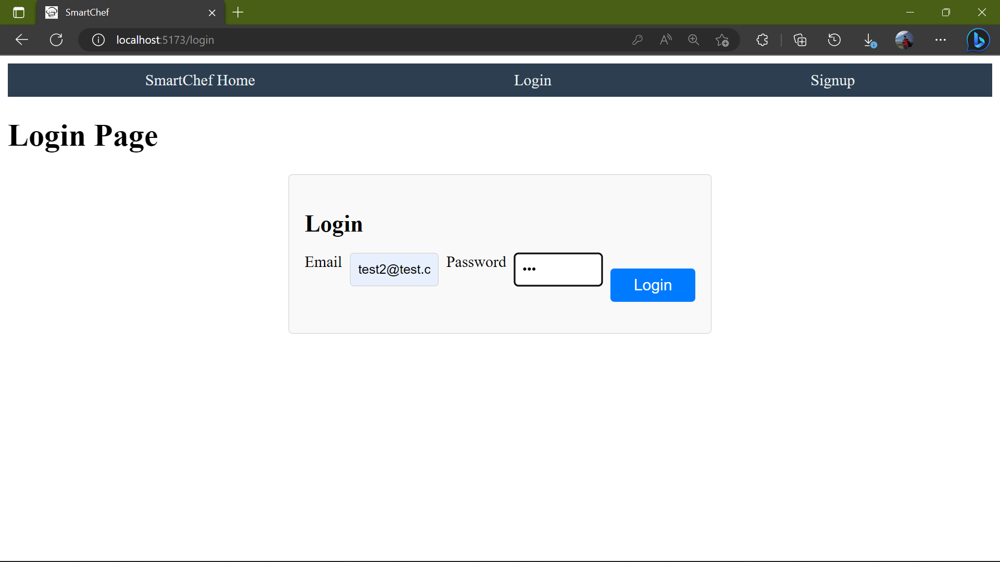

# SMART CHEF

SMART CHEF is a full-stack MERN application designed to simplify your cooking experience by providing personalized recipe recommendations based on the ingredients available in your pantry. With an intuitive user interface, secure authentication, and seamless navigation, SMART CHEF is the perfect companion for busy cooks looking for inspiration in the kitchen.

## Features

- User authentication using JSON Web Tokens (JWT)
- Create, Read, Update, and Delete (CRUD) operations for pantry items and recipes
- Personalized recipe suggestions based on user's pantry items
- Responsive and user-friendly interface

## Demo

### Smart Chef Landing Page before Login

_The landing page of the SmartChef application, featuring Login and Signup options._

### Smart Chef Login

### Smart Chef Landing Page after Login

_The landing page of the SmartChef application after loggging in, featuring Pantry, Recipes and Add a Recipe options._

### Smart Chef Pantry Items

_The Pantry Items page, where users can manage their pantry items._

### Smart Chef Recipes

_The Recipes page, showcasing personalized recipe suggestions based on user's pantry items._

### Smart Chef Add Recipe

_The Add Recipe page, allowing users to add new recipes to the application._

## Technologies Used

- MongoDB
- Express
- React
- Node.js
